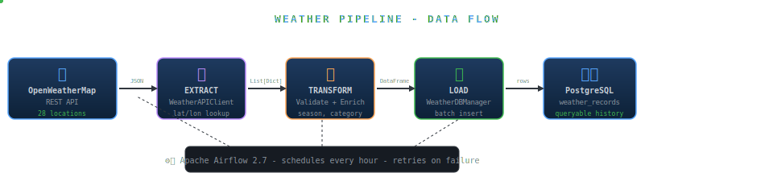

# Weather Data Pipeline

A production-grade ETL pipeline that ingests real-time weather data from the OpenWeatherMap API, transforms and validates it, and loads it into PostgreSQL - orchestrated by Apache Airflow running in Docker.

---

## Problem Statement

Weather apps show you current conditions - but they don't store or expose historical data at a granular level. Researchers, analysts, and businesses that need to detect trends, compare seasonal patterns, or correlate weather with outcomes (sales, energy usage, travel demand) have no accessible, structured, queryable weather dataset.

This pipeline collects hourly weather for 5 global cities, enriches it with derived context (season, temperature category, comfort index), and stores 30+ days of history in PostgreSQL - making weather data analytically useful, not just visually consumable.

**The core challenge:** How do you reliably move weather data from an external API into a structured database, on a schedule, with quality checks, retry logic, and full observability - without manual intervention?

This pipeline solves that with a clean separation between:
- **Ingestion** - what data comes in
- **Transformation** - what shape it takes
- **Orchestration** - when and how it runs

> **Note:** This pipeline is purpose-built as the live data infrastructure layer for the [AI Data Center Carbon & Water Footprint Predictor](https://github.com/drona23/Capstone_Research) capstone project. Instead of relying on static CSV files, the capstone's XGBoost and Prophet forecasting models consume real-time weather data produced by this pipeline - enabling live, hourly predictions of data center energy and water usage across U.S. cities.

---

## Data Flow



Hover over each arrow in the Streamlit dashboard to see what data format is passed between stages.

---

## Architecture

```
┌──────────────────────────────────────────────────────────────────────┐
│                        ORCHESTRATION LAYER                           │
│                     Apache Airflow 2.7 (Docker)                      │
│                                                                       │
│   weather_etl_hourly DAG          weather_maintenance_weekly DAG     │
│   ┌─────────────────────────┐     ┌───────────────────────────────┐  │
│   │ check_api_connection    │     │ purge_old_records             │  │
│   │         ↓               │     │           ↓                   │  │
│   │     ingest              │     │  ┌────────┴────────┐          │  │
│   │         ↓               │     │  ↓                ↓          │  │
│   │    transform            │     │ weekly_report  export_csv     │  │
│   │         ↓               │     └───────────────────────────────┘  │
│   │       load              │                                         │
│   │         ↓               │                                         │
│   │    log_summary          │                                         │
│   └─────────────────────────┘                                         │
└──────────────────────────────────────────────────────────────────────┘
          │                                          │
          ▼                                          ▼
┌─────────────────────┐                  ┌──────────────────────┐
│   SOURCE LAYER      │                  │    STORAGE LAYER     │
│                     │                  │                      │
│  OpenWeatherMap API │                  │  PostgreSQL 15       │
│  (REST, JSON)       │                  │  ┌────────────────┐  │
│                     │                  │  │ weather_records│  │
│  Cities configured  │                  │  ├────────────────┤  │
│  via environment    │                  │  │data_quality_   │  │
│  variable           │                  │  │logs            │  │
└─────────────────────┘                  │  ├────────────────┤  │
                                         │  │ pipeline_runs  │  │
┌─────────────────────┐                  │  └────────────────┘  │
│  APPLICATION LAYER  │                  └──────────────────────┘
│                     │
│  src/ingestion/     │  WeatherAPIClient
│  src/transformation/│  WeatherDataTransformer
│  src/database/      │  WeatherDatabaseManager
│  src/utils/         │  Config, Logger
└─────────────────────┘
```

---

## Data Flow

```
OpenWeatherMap API
       │
       │  Raw JSON (temperature, humidity, pressure,
       │  wind, visibility, clouds, sunrise/sunset…)
       ▼
┌─────────────────────────────────────────────────────┐
│  INGESTION  (src/ingestion/weather_api.py)          │
│  - Rate-limited API client (1 req/sec)              │
│  - test_connection() validates before fetching      │
│  - get_weather_for_cities() → List[Dict]            │
└─────────────────────────────────────────────────────┘
       │
       │  List of raw weather dicts
       ▼
┌─────────────────────────────────────────────────────┐
│  TRANSFORMATION  (src/transformation/)              │
│  - Type coercion (Unix timestamps → datetime)       │
│  - Range validation:                                │
│      temperature  → [-50°C, 60°C]                  │
│      humidity     → [0%, 100%]                      │
│      pressure     → [800, 1200 hPa]                 │
│      wind_speed   → ≥ 0 m/s                         │
│  - Derived columns:                                 │
│      date, hour, day_of_week                        │
│      temperature_category (cold/cool/mild/warm/hot) │
│      humidity_category (dry/comfortable/humid)      │
│      wind_category (calm/breeze/windy/stormy)       │
│      season (spring/summer/autumn/winter)           │
│  - Data quality report (null counts, outliers)      │
│  - CSV backup to data/                              │
└─────────────────────────────────────────────────────┘
       │
       │  Clean pandas DataFrame
       ▼
┌─────────────────────────────────────────────────────┐
│  LOADING  (src/database/operations.py)              │
│  - Batch insert into weather_records                │
│  - Log quality metrics to data_quality_logs         │
│  - Log run metadata to pipeline_runs                │
└─────────────────────────────────────────────────────┘
       │
       ▼
  PostgreSQL 15
```

---

## Database Schema

```
weather_records
┌──────────────────────┬──────────────────┬─────────────────────────────┐
│ Column               │ Type             │ Description                 │
├──────────────────────┼──────────────────┼─────────────────────────────┤
│ id                   │ UUID (PK)        │ Auto-generated row ID       │
│ city                 │ VARCHAR          │ City name                   │
│ country              │ VARCHAR          │ Country code                │
│ latitude             │ FLOAT            │ Coordinates                 │
│ longitude            │ FLOAT            │ Coordinates                 │
│ timestamp            │ DATETIME         │ Observation time (UTC)      │
│ date                 │ DATE             │ Derived from timestamp      │
│ hour                 │ INTEGER          │ Hour of day (0–23)          │
│ day_of_week          │ VARCHAR          │ Monday–Sunday               │
│ season               │ VARCHAR          │ spring/summer/autumn/winter │
│ temperature          │ FLOAT            │ °C                          │
│ feels_like           │ FLOAT            │ °C                          │
│ temperature_category │ VARCHAR          │ cold/cool/mild/warm/hot     │
│ humidity             │ FLOAT            │ %                           │
│ humidity_category    │ VARCHAR          │ dry/comfortable/humid       │
│ pressure             │ FLOAT            │ hPa                         │
│ wind_speed           │ FLOAT            │ m/s                         │
│ wind_direction       │ FLOAT            │ degrees                     │
│ wind_category        │ VARCHAR          │ calm/breeze/windy/stormy    │
│ description          │ VARCHAR          │ e.g. "light rain"           │
│ weather_main         │ VARCHAR          │ e.g. "Rain"                 │
│ visibility           │ FLOAT            │ meters                      │
│ clouds               │ FLOAT            │ % cloud cover               │
│ sunrise              │ DATETIME         │ Local sunrise time          │
│ sunset               │ DATETIME         │ Local sunset time           │
│ run_id               │ VARCHAR          │ Links to pipeline_runs      │
│ created_at           │ DATETIME         │ Row insert time             │
└──────────────────────┴──────────────────┴─────────────────────────────┘

pipeline_runs
┌──────────────────┬──────────────┬─────────────────────────────────────┐
│ Column           │ Type         │ Description                         │
├──────────────────┼──────────────┼─────────────────────────────────────┤
│ run_id           │ VARCHAR (PK) │ UUID for this execution             │
│ cities_processed │ INTEGER      │ Number of cities in this run        │
│ records_processed│ INTEGER      │ Rows loaded                         │
│ status           │ VARCHAR      │ completed / failed                  │
│ error_message    │ TEXT         │ Error details if failed             │
│ created_at       │ DATETIME     │ Run start time                      │
└──────────────────┴──────────────┴─────────────────────────────────────┘

data_quality_logs
┌──────────────────┬──────────────┬─────────────────────────────────────┐
│ Column           │ Type         │ Description                         │
├──────────────────┼──────────────┼─────────────────────────────────────┤
│ id               │ UUID (PK)    │ Auto-generated                      │
│ run_id           │ VARCHAR (FK) │ Links to pipeline_runs              │
│ total_records    │ INTEGER      │ Records processed                   │
│ null_counts      │ JSON         │ Per-column null counts              │
│ outlier_counts   │ JSON         │ Per-column out-of-range counts      │
│ created_at       │ DATETIME     │ Log time                            │
└──────────────────┴──────────────┴─────────────────────────────────────┘
```

---

## Airflow DAGs

### DAG 1: `weather_etl_hourly`

Runs every hour. Ingests, transforms, and loads weather data.

```
check_api_connection
        │
        │  (only proceeds if API is reachable)
        ▼
     ingest
        │  XCom: List[Dict] raw weather records
        ▼
   transform
        │  XCom: { records: List[Dict], quality_report: Dict }
        ▼
      load
        │  XCom: int (rows loaded)
        ▼
  log_summary
```

| Task | Retries | What it does |
|------|---------|-------------|
| `check_api_connection` | 2 | Calls `test_connection()`, raises if unreachable |
| `ingest` | 2 | Fetches weather for all configured cities |
| `transform` | 2 | Cleans, validates, adds derived columns |
| `load` | 2 | Inserts to DB, logs quality metrics |
| `log_summary` | 2 | Writes final run record to `pipeline_runs` |

### DAG 2: `weather_maintenance_weekly`

Runs every Sunday. Keeps the database healthy.

```
purge_old_records
        │
   ┌────┴────┐
   ▼         ▼
weekly    export
report    weekly
          CSV
```

| Task | What it does |
|------|-------------|
| `purge_old_records` | Deletes `weather_records` older than `RETENTION_DAYS` (default: 30) |
| `generate_weekly_report` | Computes 7-day aggregated stats per city, stored in XCom |
| `export_weekly_csv` | Dumps past 7 days to `data/weekly_backups/weekly_backup_YYYYMMDD.csv` |

---

## Tech Stack

| Layer | Technology | Version |
|-------|-----------|---------|
| Orchestration | Apache Airflow | 2.7.3 |
| Containerization | Docker + Docker Compose | - |
| Database | PostgreSQL | 15 |
| ORM | SQLAlchemy | 2.0.23 |
| DB Driver | psycopg2-binary | 2.9.9 |
| Data Processing | pandas | 2.2.0 |
| Numerical | numpy | 1.26.4 |
| HTTP Client | requests | 2.31.0 |
| Config | python-dotenv | 1.0.0 |
| Logging | structlog | 23.2.0 |
| Testing | pytest | 7.4.3 |
| Linting | flake8, black | 6.1.0 / 23.11.0 |

---

## Project Structure

```
weather_pipeline/
├── dags/                          # Airflow DAG definitions
│   ├── weather_etl_dag.py         # Hourly ETL pipeline
│   └── weather_maintenance_dag.py # Weekly cleanup + export
│
├── src/                           # Core application code
│   ├── ingestion/
│   │   ├── weather_api.py         # WeatherAPIClient
│   │   └── mock_weather_api.py    # Mock client for testing
│   ├── transformation/
│   │   └── weather_transformer.py # WeatherDataTransformer
│   ├── database/
│   │   ├── models.py              # SQLAlchemy models
│   │   └── operations.py          # WeatherDatabaseManager
│   ├── utils/
│   │   ├── config.py              # Config (reads from .env)
│   │   └── logger.py              # structlog setup
│   └── main.py                    # Standalone pipeline runner
│
├── docker/
│   └── init.sql                   # PostgreSQL bootstrap SQL
│
├── data/                          # CSV backups (gitignored)
├── logs/                          # Airflow logs (gitignored)
├── plugins/                       # Airflow plugins (empty)
│
├── docker-compose.yml             # PostgreSQL + Airflow services
├── requirements.txt
├── setup.py
├── test_pipeline.py               # Integration tests
├── test_mock_pipeline.py          # Unit tests (no DB/API needed)
├── env.example                    # Template for .env
└── README.md
```

---

## Setup & Installation

### Prerequisites

- Docker Desktop installed and running
- Python 3.10+
- OpenWeatherMap API key (free tier works): https://openweathermap.org/api

### 1. Clone and configure

```bash
git clone https://github.com/drona23/weather-pipeline.git
cd weather_pipeline

cp env.example .env
# Edit .env - set OPENWEATHER_API_KEY and CITIES
```

### 2. Configure `.env`

```env
# OpenWeatherMap
OPENWEATHER_API_KEY=your_api_key_here
OPENWEATHER_BASE_URL=https://api.openweathermap.org/data/2.5

# PostgreSQL (matches docker-compose defaults)
DB_HOST=localhost
DB_PORT=15432
DB_NAME=weather_data
DB_USER=weather_user
DB_PASSWORD=weather_password

# Pipeline config
CITIES=New York,London,Tokyo,Sydney,Mumbai
LOG_LEVEL=INFO
DATA_DIR=data
RETENTION_DAYS=30
```

### 3. Start the database

```bash
docker-compose up -d postgres
```

### 4. Run the pipeline manually (no Airflow needed)

```bash
pip install -r requirements.txt
python -m src.main
```

### 5. Start Airflow (optional, for scheduled runs)

```bash
# First-time setup
docker-compose --profile airflow up airflow-init

# Start Airflow services
docker-compose --profile airflow up -d

# Open Airflow UI
open http://localhost:8080
# Default login: airflow / airflow
```

The DAGs will appear automatically - `weather_etl_hourly` and `weather_maintenance_weekly`. Toggle them on to activate scheduling.

---

## Running Tests

```bash
# Unit tests (no external dependencies)
pytest test_mock_pipeline.py -v

# Integration tests (requires running PostgreSQL)
pytest test_pipeline.py -v
```

---

## Key Design Decisions

**Why separate the DAGs from the pipeline logic?**
The `src/` modules are self-contained and testable without Airflow. The DAGs in `dags/` are just a thin orchestration layer - they call existing methods. This means you can run the pipeline locally with `python -m src.main` and get identical behavior to what Airflow executes.

**Why two DAGs instead of one?**
ETL concerns (hourly, latency-sensitive) and maintenance concerns (weekly, non-critical) have different schedules, retry needs, and failure impacts. Combining them would mean a failed cleanup job blocks data ingestion.

**Why serialize DataFrames between Airflow tasks?**
Airflow passes data between tasks via XCom, which stores values in its metadata database as JSON. DataFrames are not JSON-serializable directly, so they are converted to `dict` records before XCom push and reconstructed in the downstream task. For very large DataFrames, the right pattern is to write to a file/S3 and pass only the path.

**Why SQLAlchemy ORM instead of raw SQL?**
Keeps the schema definition co-located with the application code (models.py), enables type-safe queries, and makes database migrations straightforward. Raw SQL analytics queries are used separately for reporting - see `sql/analytics.sql`.

---

## What This Project Demonstrates

| Skill | Where |
|-------|-------|
| ETL pipeline design | `src/main.py` + DAG wiring |
| API ingestion with rate limiting | `src/ingestion/weather_api.py` |
| Data cleaning & validation | `src/transformation/weather_transformer.py` |
| Airflow DAG authoring (TaskFlow API) | `dags/weather_etl_dag.py` |
| Task dependency graphs | `api_ok >> raw` (ETL DAG), `purged >> [report, csv]` (maintenance DAG) |
| XCom data passing | Between all DAG tasks |
| PostgreSQL schema design | `src/database/models.py` |
| Data quality logging | `data_quality_logs` table + `log_data_quality()` |
| Containerized infrastructure | `docker-compose.yml` |
| Separation of concerns | src/ (logic) vs dags/ (orchestration) |
| Retry & failure handling | `retries=2`, `retry_delay=timedelta(minutes=5)` |
| Scheduled data retention | `weather_maintenance_weekly` DAG |

---

## Analytics Queries

The `sql/analytics.sql` file contains 15 queries across 4 categories that demonstrate real analytical work on the collected data:

| Category | Queries | Concepts |
|----------|---------|---------|
| Basic Aggregations | 1–3 | GROUP BY, AVG, COUNT, CASE WHEN |
| CTE Queries | 4–7 | WITH clauses, chained CTEs, anomaly detection, comfort scoring |
| Window Functions | 8–13 | RANK, rolling AVG, LAG, PERCENT_RANK, FIRST/LAST VALUE |
| Pipeline Health | 14–15 | Success rate, week-over-week volume trends |

Run any query against the PostgreSQL instance after starting Docker:
```bash
docker-compose up -d postgres
psql -h localhost -p 15432 -U weather_user -d weather_data -f sql/analytics.sql
```

---

## Author

**Drona Gangarapu**
MS Data Science, Pace University
[github.com/drona23](https://github.com/drona23)
